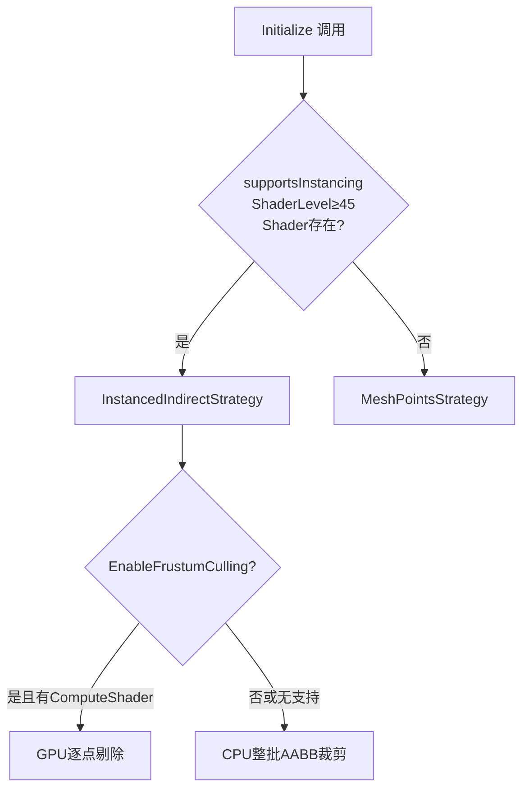

# PointCloudRenderer 点云渲染工具使用指南

> 适用版本：OhMyPackage Runtime / Unity URP  
> 渲染管线：Universal Render Pipeline (URP)  
> 更新日期：2026-06-08

---

## 一、整体架构

```
PointCloudRenderer（MonoBehaviour · 协调者）
│
│  持有数据：positions[] / colors[] / bounds
│  每帧驱动：Update → dirty check → RebuildBuffers → Draw
│
├─► IPointCloudRenderStrategy（策略接口）
│     ├── TryInitialize(config)   — 初始化 GPU 资源，失败返回 false
│     ├── RebuildBuffers(...)     — 数据变化时重建 Buffer
│     ├── Draw(bounds, cam, layer)— 每帧提交绘制命令
│     └── Release()               — 销毁 GPU 资源
│
├─► InstancedIndirectStrategy     — 优先级 1（高性能 GPU 实例化）
└─► MeshPointsStrategy            — 优先级 2（Mesh 点拓扑，兼容回退）
```

**设计原则：**
- `PointCloudRenderer` 只管数据与生命周期，不涉及任何 GPU/Shader 操作
- 渲染策略相互独立，新增策略只需实现 `IPointCloudRenderStrategy` 并插入 `SelectStrategy` 数组
- 策略选择在 `Initialize()` 时一次完成，运行时不切换

---

## 二、渲染策略对比

### 2.1 InstancedIndirectStrategy（GPU 实例化）

| 项目 | 说明 |
|------|------|
| **渲染 API** | `Graphics.DrawMeshInstancedIndirect` |
| **Mesh** | 运行时创建临时 Cube，取其 SharedMesh |
| **着色** | `InstancedShader`：按世界空间 **Y 轴高度**自动渐变（蓝→青→绿→黄→红） |
| **颜色输入** | CPU 传入的 `Color32[]` **不被使用**，颜色完全由 Shader 计算 |
| **Buffer 布局** | 每个点编码为 `float4x4 TRS 矩阵`（stride = 64 字节），scale = pointSize |
| **视锥体剔除** | 支持两级：① CPU 整批次 AABB 裁剪；② 可选 GPU 逐点剔除（需 Compute Shader） |
| **GPU 剔除原理** | `FrustumCulling.compute` 的 `ViewPortCulling` Kernel：对每个点的 Cube AABB 8 顶点逐视锥面测试，全部在某面外则丢弃，通过者 Append 到输出 Buffer |
| **硬件要求** | `SystemInfo.supportsInstancing` = true，`graphicsShaderLevel` ≥ 45，Shader 必须存在 |
| **适用场景** | 百万级以上点云、PC/主机平台、对帧率要求高 |

**Buffer 生命周期：**
```
RebuildBuffers
  ├── 释放旧 Buffer（防泄漏）
  ├── 构建 Matrix4x4[] → positionInputBuffer（StructuredBuffer<float4x4>）
  ├── 若开启剔除 → 创建 positionOutputBuffer（AppendStructuredBuffer）
  └── 填充 argsBuffer（IndirectArguments）

Draw
  ├── CPU AABB 裁剪（整批次，不满足直接 return）
  ├── 若开启 GPU 剔除 → DrawWithCulling
  │     ├── positionOutputBuffer.SetCounterValue(0)
  │     ├── 绑定 planes[6]、input、cullresult
  │     ├── Dispatch(ceil(count/640), 1, 1)
  │     └── CopyCount → argsBuffer[1]（更新实例数）
  └── Graphics.DrawMeshInstancedIndirect(...)
```

---

### 2.2 MeshPointsStrategy（Mesh 点拓扑）

| 项目 | 说明 |
|------|------|
| **渲染 API** | `MeshRenderer`（由 Unity 自动每帧提交，无需手动 DrawCall） |
| **Mesh 拓扑** | `MeshTopology.Points`（每个顶点 = 一个点） |
| **着色** | `VertexColorQuadConstSize` Shader：**逐点顶点色**（Color32 数组完全生效） |
| **几何扩展** | Geometry Shader 将每个顶点展开为屏幕固定像素大小的四边形 |
| **点大小单位** | 材质属性 `_PointSize`（**屏幕像素**，与视距无关） |
| **视锥体剔除** | 不支持（`EnableFrustumCulling` 为 no-op），引擎自动按 Mesh.bounds 剔除整批 |
| **硬件要求** | 无特殊要求，`TryInitialize` 始终返回 true（兼容回退） |
| **适用场景** | 移动平台、低端设备、需要精确逐点颜色、点数 < 50 万 |

**Buffer 生命周期：**
```
TryInitialize
  ├── 创建子 GameObject "PointCloud_MeshPoints"
  ├── 添加 MeshFilter + MeshRenderer
  ├── 创建 Mesh（MarkDynamic）
  └── 加载 Shader，创建 Material

RebuildBuffers
  ├── mesh.Clear()
  ├── mesh.SetVertices(positions)
  ├── mesh.SetColors(colors)    ← Color32 在此生效
  ├── 缓存/复用 indices 数组（避免 GC）
  └── mesh.SetIndices(indices, MeshTopology.Points)

Draw（轻量）
  ├── 同步 mesh.bounds（确保引擎视锥裁剪正确）
  └── 同步 rootObject.layer
```

---

### 2.3 策略选择流程



---

### 2.4 两种策略综合对比

| 维度 | InstancedIndirect | MeshPoints |
|------|-------------------|------------|
| 性能上限 | ★★★★★（百万级） | ★★★（~50万） |
| 颜色控制 | 高度自动渐变（无法逐点） | 逐点颜色（Color32 完全生效） |
| 点大小单位 | 世界空间（透视缩放） | 屏幕像素（固定大小） |
| 视锥体剔除 | 两级（CPU + 可选 GPU） | 整批引擎剔除 |
| 硬件要求 | Shader Model 4.5+ | 无限制 |
| 额外资源 | 需配置 FrustumCulling.compute | 无 |
| 透明度/粒子效果 | Geometry Shader 无 | Geometry Shader 四边形 |
| 内存占用 | 64 字节/点（矩阵） | ~12 字节/点（顶点 + 颜色） |

---

## 三、Inspector 参数说明

| 参数 | 类型 | 默认值 | 说明 |
|------|------|--------|------|
| `_enableFrustumCulling` | bool | false | 是否启用 GPU 视锥体剔除（仅 InstancedIndirect 策略，需要 Compute Shader） |
| `_pointSize` | float [0.001, 1] | 0.05 | 点大小；InstancedIndirect = 世界单位，MeshPoints = 屏幕像素 |
| `_renderingLayer` | int | 0 | 渲染 Layer（0 = 使用 GameObject 自身 Layer） |
| `_frustumCullingCompute` | ComputeShader | null | `FrustumCulling.compute`，启用 GPU 剔除时必须赋值，**直接拖入即可，无需放 Resources 文件夹** |
| `_renderCamera` | Camera | null | 渲染/剔除相机，留空自动使用 `Camera.main` |

---

## 四、公开 API 用法

### 4.1 基础用法

```csharp
// 挂载 PointCloudRenderer 后，直接调用 SetPoints 即可（首次自动初始化）
var renderer = GetComponent<PointCloudRenderer>();

Vector3[] positions = /* ... 你的点云位置数据 ... */;
renderer.SetPoints(positions);                 // 仅位置（MeshPoints 路径颜色默认白色）
```

### 4.2 带颜色的点云

```csharp
Vector3[] positions = new Vector3[1000];
Color32[] colors    = new Color32[1000];
// ... 填充数据 ...

renderer.SetPoints(positions, colors);
// 注意：InstancedIndirect 路径颜色由高度自动计算，colors 在此路径无效
```

### 4.3 增量追加

```csharp
// 适用于实时点云流（如 LiDAR 实时扫描）
renderer.AppendPoints(newPositions, newColors);

// 注意：频繁大批量追加会导致数组扩容 GC，
// 若每帧追加量大，建议积累后整体调用 SetPoints
```

### 4.4 运行时调整参数

```csharp
// 调整点大小（下一帧自动 RebuildBuffers）
renderer.PointSize = 0.02f;

// 动态切换视锥体剔除
renderer.EnableFrustumCulling = true;

// 查看当前渲染路径（调试用）
Debug.Log(renderer.CurrentRenderPath);   // "InstancedIndirect" 或 "MeshPoints"
Debug.Log(renderer.PointCount);          // 当前点数
```

### 4.5 手动管理包围盒

```csharp
// 对于已知范围的点云，手动设置 Bounds 可跳过 O(n) 的 AABB 计算
renderer.SetBounds(new Bounds(Vector3.zero, new Vector3(100, 10, 100)));

// 通常不需要手动调用，SetPoints / AppendPoints 会自动计算
```

### 4.6 高度渐变范围调整（仅 InstancedIndirect）

```csharp
// 如果 InstancedShader 暴露了 _HeightMin / _HeightMax 属性
var strategy = /* 通过反射或预转型获取 */ ;
if (renderer.CurrentRenderPath == "InstancedIndirect")
{
    // 需通过策略实例调用（暂无公开入口，可按需扩展 PointCloudRenderer）
}
```

### 4.7 多相机场景

```csharp
// 若场景有多个相机，明确指定剔除相机
renderer.SetCamera(mySecondaryCamera);
```

### 4.8 资源释放

```csharp
// OnDestroy 会自动调用 Release()
// 若需提前释放（如切换场景前清理 GPU 内存）：
renderer.Release();

// 清空数据但保留渲染器
renderer.Clear();
```

---

## 五、启用 GPU 视锥体剔除（步骤）

1. 在 Inspector 勾选 **Enable Frustum Culling**
2. 将 `FrustumCulling.compute` 拖入 Inspector 的 **Frustum Culling Compute** 槽位
3. 确认平台支持 Compute Shader（PC/主机，移动端部分支持）
4. 运行时 Console 输出 `Strategy=InstancedIndirect | Culling=True` 即为生效

> **工作原理**：`ViewPortCulling` Kernel 以 640 线程为一组并行测试每个点的 Cube AABB 8 顶点，  
> 对 6 个视锥面逐一测试，任意面完全在外则丢弃，通过的点 Append 到输出 Buffer，  
> 最终通过 `CopyCount` 更新 ArgsBuffer 中的实例数，实现 GPU 侧精确剔除。

---

## 六、Shader 说明

| Shader 文件 | 路径 | 用途 |
|-------------|------|------|
| `InstancedShader.shader` | `Instanced/URP/InstancedShader` | GPU 实例化路径，读取 `positionBuffer`（float4x4），按 Y 高度着色 |
| `VertexColorQuadConstSize.shader` | `PCDLib/VertexColor Quad ConstSize` | Mesh 点拓扑路径，Geometry Shader 展开为屏幕固定像素四边形，支持逐点颜色 |
| `FrustumCulling.compute` | Inspector 直接赋值 | GPU 视锥体剔除 Compute Shader，`numthreads(640,1,1)` |

---

## 七、常见问题

### Q1：点云看不见
- 检查 `_renderCamera` 是否指向正确相机
- 检查 `_renderingLayer` 与相机 Culling Mask 是否匹配
- 调用 `SetPoints` 后 Console 有无报错

### Q2：启用视锥体剔除后点云消失
- 确认 `FrustumCullingCompute` 已在 Inspector 赋值
- 确认平台支持 Compute Shader（`SystemInfo.supportsComputeShaders`）
- 检查 `bounds` 是否正确（`SetBounds` 或自动计算的 AABB 是否覆盖所有点）

### Q3：InstancedIndirect 路径下颜色不对
- 此路径颜色**由 Shader 按 Y 轴高度自动计算**，CPU 传入的 Color32 数组在此路径无效
- 如需精确逐点颜色，考虑强制使用 MeshPoints 路径（可临时禁用实例化 Shader 触发降级）

### Q4：频繁追加点导致卡顿
- `AppendPoints` 会触发 `Array.Resize`（数组扩容 + 数据拷贝），然后上传至 GPU
- 建议：积累一帧/一批数据后一次性调用 `SetPoints`，或预分配足够大的初始数组

### Q5：切换场景内存未释放
- `OnDestroy` 会自动调用 `Release()`，但场景切换时若 GameObject 被 DontDestroyOnLoad 需手动调用 `Release()`

---

## 八、文件结构

```
PointCloud/
├── PointCloudRenderer.cs           # 协调者（MonoBehaviour，入口）
├── IPointCloudRenderStrategy.cs    # 策略接口
├── PointCloudRenderConfig.cs       # 初始化配置数据类
├── InstancedIndirectStrategy.cs    # 策略一：GPU 实例化（高性能）
├── MeshPointsStrategy.cs           # 策略二：Mesh 点拓扑（兼容回退）
├── InstancedShader.shader          # GPU 实例化 Shader（高度渐变着色）
├── VertexColorQuadConstSize.shader # Mesh 点拓扑 Shader（逐点颜色 + 固定像素大小）
└── FrustumCulling.compute          # GPU 视锥体剔除 Compute Shader
```
